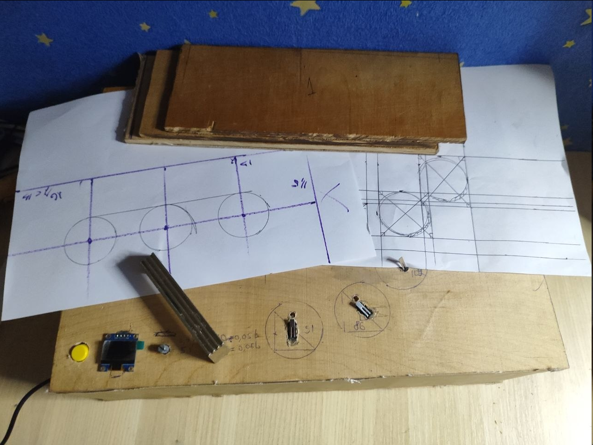
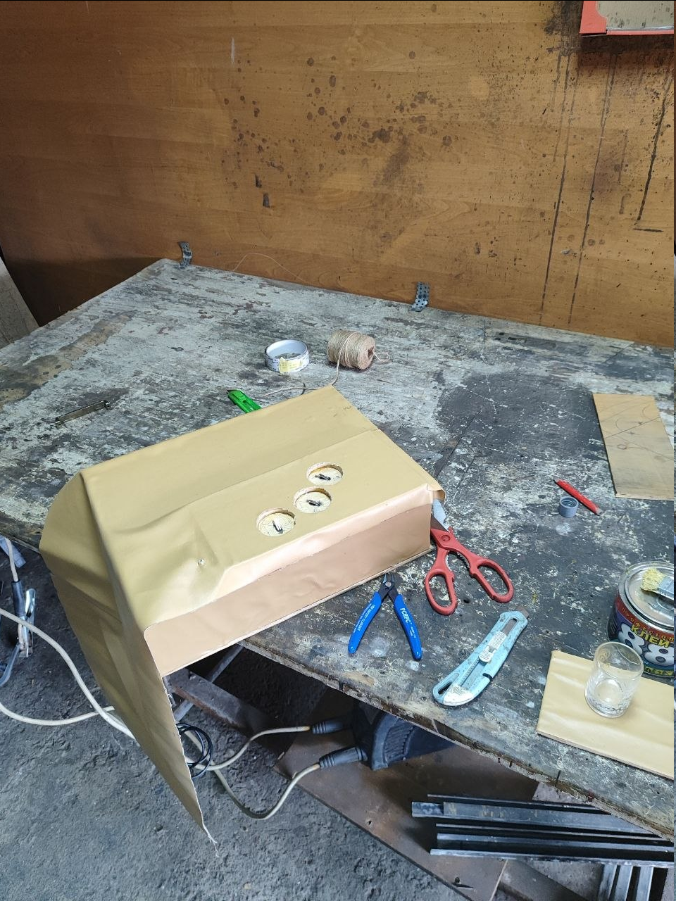
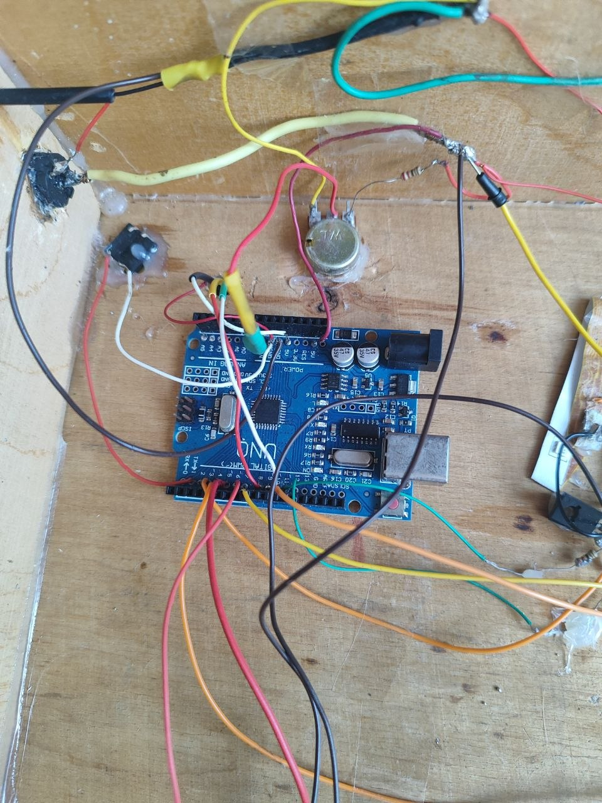
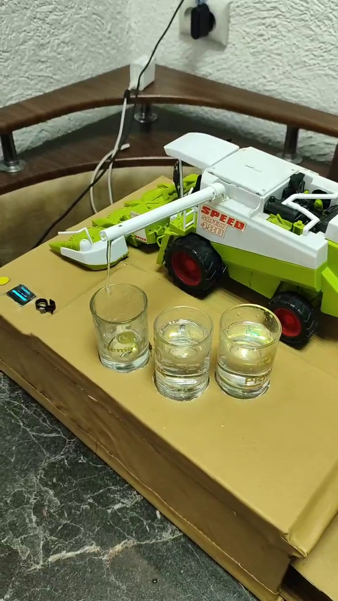

# 🤖 Bar Bot (Automatic Bartender in a Toy Combine Harvester)

A unique automatic bar-bot built on an **Arduino Uno R3** microcontroller and creatively integrated into the body of a toy agricultural machine. The device automatically detects the presence of cups, smoothly controls the dispenser via a servo motor, dispenses beverages with milliliter precision, and operates in a conveyor mode.

---

## 🎬 Video Demonstration

Check out the video review of the automatic Bar-Bot in action:

  

---

## 📸 Gallery and Assembly Stages

  <table>
    <tr align="center">
      <td>
        <h3>📐 Design & Blueprints</h3>
        
         
        <em>Drafting and planning the layout</em>
      </td>
      <td>
        <h3>🎨 Enclosure Work</h3>
        
         
        <em>Wrapping parts and preparing the base</em>
      </td>
    </tr>
    <tr align="center">
      <td>
        <h3>⚙️ Electronics</h3>
        
         
        <em>Internal wiring and soldering components</em>
      </td>
      <td>
        <h3>🚀 Final Result</h3>
        
         
        <em>The Bar-Bot fully assembled and ready</em>
      </td>
    </tr>
  </table>

---

## ✨ Main Features

* **Conveyor Mode:** If there are multiple cups on the base (2 to 3), the bot will sequentially and automatically fill all of them without unnecessary movements.
* **Smooth Kinematics (Soft Start):** The crane moves smoothly step-by-step, eliminating sharp jerks, protecting the servo gears, and giving the device a premium feel.
* **Emergency Stop (Anti-Drip):** If a cup is removed during pouring, the sensor detects it instantly, stops the flow, and reverses the pump to prevent spilling.
* **Flexible Volume Control:** You can easily adjust the portion size (in 5 ml increments) using a potentiometer.
* **Intuitive LED Indication:** A dual-color LED clearly displays the system status (Green — ready/success, Red — error/abort, and Yellow — during the pouring process).
* **"Lonely Bartender" Protection 🍻:** If you place only 1 cup and try to start pouring, the bot will display a joking warning on the screen and refuse to pour (however, the cleaning mode for a single cup works as usual).
* **Cleaning Mode:** Holding the "Start" button for 5 seconds activates the system flush/cleaning mode.

---

## 🛠 Hardware Specification

| Component | Name / Model | Purpose |
| :--- | :--- | :--- |
| **Microcontroller** | Arduino Uno R3 | The main brain of the device |
| **Enclosure** | Toy Combine Harvester | Creative shell for the project |
| **Display** | OLED 128x64 (SSD1306, Soft I2C) | Displays status, volume, and animations |
| **Servo Motor** | MG996R / SG90 (or equivalent) | Positions the crane over the cups |
| **Motor Driver** | DRV8833 (or L298N) | Controls and reverses the water pump |
| **Pump** | 5V Mini Liquid Pump | Pumps the beverage |
| **Presence Sensors** | Limit Switches | Detects cups at 3 specific positions |
| **Controls** | Potentiometer + "Start" Button | Selects volume and triggers the process |
| **Indication** | Dual-color LED (Red/Green) | Visual alerts (Ready=Green, Error=Red, Pouring=Yellow) |

---

## 📌 Pinout (for Arduino Uno)

* **Display (Soft I2C):** Clock = `8`, Data = `10`
* **Potentiometer:** `A0`
* **"Start" Button:** `2` (with pull-up resistor)
* **Pump Driver (DRV8833):** PWM pin = `5`, Direction/Reverse = `6`
* **Servo Motor:** `9`
* **LEDs:** Red = `12`, Green = `11`
* **Cup Limit Switches:** Position 1 = `4`, Position 2 = `3`, Position 3 = `7`

---

## 💻 Source Code

The full source code for the Arduino IDE is located in the **`firmware/bar_bot.ino`** file in this repository.

---

## 🚀 How to Install and Upload

1. Open **Arduino IDE**.
2. Install the necessary libraries via the Library Manager (`Tools -> Manage Libraries...`):
   * **U8g2** (for the OLED display)
   * **Servo** (standard library for servo control)
3. Upload the code from the `firmware/code.txt` file to your **Arduino Uno R3** board.

---

## 📈 What I'd Improve Next

* **Add power connectors and a peripheral connection bus** to make future maintenance, disassembly, and modular component replacement inside the combine body more convenient.
* **Optimize internal cable management** using additional mounts and custom 3D-printed elements to securely fix the wiring harness.

---

## 🎯 Skills Demonstrated

* **Embedded C++ Programming**: Implementing non-blocking logic, state machine management, and custom UI output via the U8g2 library.
* **Hardware Integration & Prototyping**: Working with the Arduino Uno, configuring servo kinematics, and PWM control for the pump motor driver.
* **Sensor Interfacing**: Polling limit switches for safety interlocks, cup detection, and conveyor-style fluid dispensing.
* **Mechanical Integration & Engineering Creativity**: Unconventional integration of electronics and mechanical assemblies into an existing toy enclosure.

---

## 👨‍💻 Author

Levyk — Telecommunications & Radio Engineering student, Lviv Polytechnic National University [GitHub](https://github.com/Levyyk).
