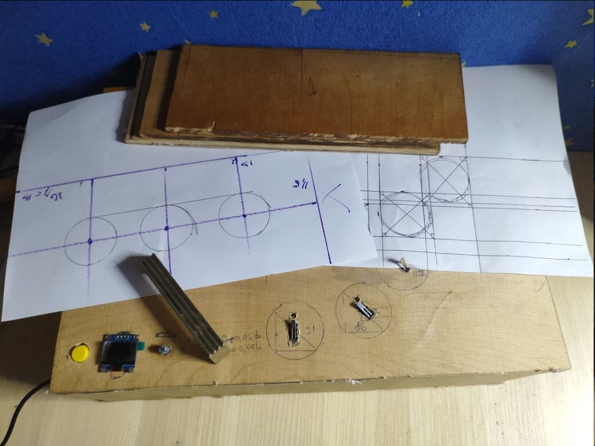
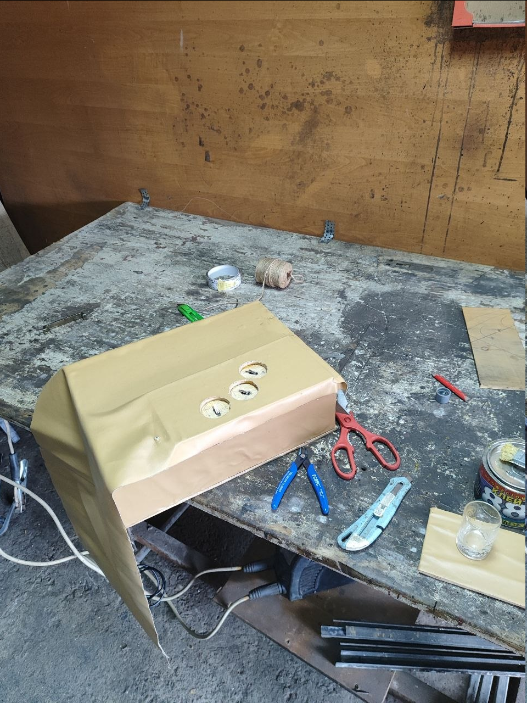
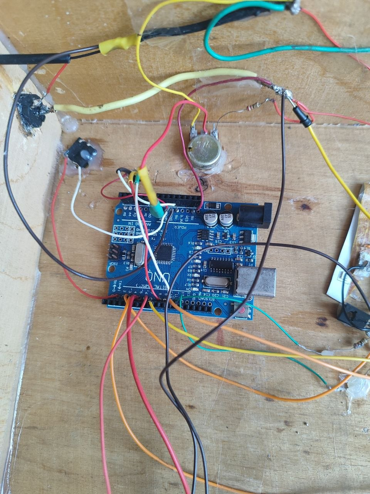
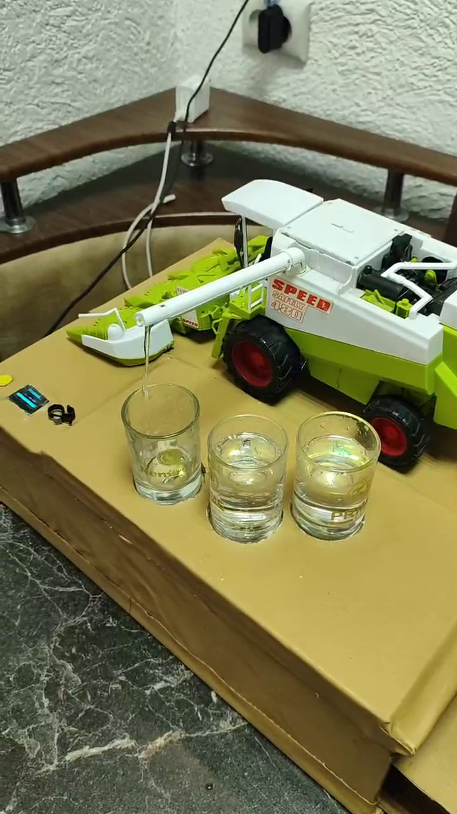

# 🤖 Bar Bot (Automatic Bartender in a Toy Combine Harvester)

A unique automatic bar-bot built on an **Arduino Uno R3** microcontroller and creatively integrated into the body of a toy agricultural machine. The device automatically detects the presence of cups, smoothly controls the dispenser via a servo motor, dispenses water-calibrated portions in 5 ml steps, and operates in a conveyor mode.

> This repository is also an engineering retrospective: see **[Known Issues & Lessons Learned](#-known-issues--lessons-learned)** for what went wrong and what I would do differently.

---

## 🎬 Video Demonstration

Check out the video review of the automatic Bar-Bot in action:

  

---

## 📸 Gallery and Assembly Stages

  <table>
    <tr align="center">
      <td>
        <h3>📐 Design & Blueprints</h3>
        
         
        <em>Drafting and planning the layout</em>
      </td>
      <td>
        <h3>🎨 Enclosure Work</h3>
        
         
        <em>Wrapping parts and preparing the base</em>
      </td>
    </tr>
    <tr align="center">
      <td>
        <h3>⚙️ Electronics</h3>
        
         
        <em>Internal point-to-point wiring and soldering components</em>
      </td>
      <td>
        <h3>🚀 Final Result</h3>
        
         
        <em>The Bar-Bot fully assembled and ready</em>
      </td>
    </tr>
  </table>

---

## ✨ Main Features

* **Conveyor Mode:** If there are multiple cups on the base (2 to 3), the bot will sequentially and automatically fill all of them without unnecessary movements.
* **Smooth Kinematics (Soft Start):** The crane moves smoothly step-by-step (15 ms per degree), eliminating sharp jerks and protecting the servo gears.
* **Emergency Stop:** If a cup is removed during pouring, the limit switch detects it, stops the pump, and briefly reverses it (150 ms) to pull back the liquid in the nozzle and prevent spilling.
* **Flexible Volume Control:** Adjust the portion size from 10 to 50 ml in 5 ml steps using a potentiometer.
* **RGB Status Lighting:** An RGB LED strip under the cups doubles as a status indicator: **Red** — no cup / pouring refused, **Yellow** — pouring in progress, **Green** — pouring complete.
* **"Lonely Bartender" Protection 🍻:** If you place only 1 cup and try to start pouring, the bot will display a joking warning on the screen and refuse to pour (however, the cleaning mode for a single cup works as usual).
* **Cleaning Mode:** With a single cup on position 1, holding the "Start" button for 5 seconds activates the flush/cleaning mode; the pump runs at full power while the button is held.

---

## 🛠 Hardware Specification

| Component | Name / Model | Purpose |
| :--- | :--- | :--- |
| **Microcontroller** | Arduino Uno R3 | The main brain of the device |
| **Enclosure** | Toy Combine Harvester | Creative shell for the project |
| **Display** | OLED 128x64 (SSD1306, Soft I2C) | Displays status, volume, and animations |
| **Servo Motor** | MG90S (metal gears) | Positions the crane over the cups |
| **Motor Driver** | DRV8833 | Controls and reverses the water pump |
| **Pump** | 5V Mini Liquid Pump | Pumps the beverage |
| **Pump Noise Suppression** | 0.1 µF ceramic capacitor | Suppresses brush noise across the pump terminals |
| **Presence Sensors** | Limit Switches | Detects cups at 3 specific positions |
| **Controls** | Potentiometer + "Start" Button | Selects volume and triggers the process |
| **Lighting / Indication** | RGB LED strip | Under-cup lighting and status indication |
| **LED Switching** | 2 × N-channel MOSFET IRLZ44N | Logic-level switching of the strip channels from 5 V Arduino pins |
| **Power Supply** | 5 V / 2 A mains adapter | Powers everything (see Known Issues) |

> ⚠️ **Power warning:** the adapter is connected directly to the Arduino **5V pin**, which bypasses the on-board regulator and has **no overvoltage or reverse-polarity protection**. Use a regulated **5 V** supply only. Connecting 9-12 V will damage the whole device.

---

## 📌 Pinout (for Arduino Uno)

* **Display (Soft I2C):** Clock = `8`, Data = `10`
* **Potentiometer:** `A0`
* **"Start" Button:** `2` (internal pull-up)
* **Pump Driver (DRV8833):** Forward (PWM) = `5`, Reverse = `6`
* **Servo Motor:** `9`
* **RGB Strip (via IRLZ44N gates):** Red = `12`, Green = `11` (the firmware does not drive a blue channel; yellow is red + green)
* **Cup Limit Switches:** Position 1 = `4`, Position 2 = `3`, Position 3 = `7` (internal pull-up, pressed = cup present)

---

## 🧪 Dosing and Calibration

Dosing is **time-based (open loop)**: the pump runs at PWM 190/255 for `volume × 334 ms`. The coefficient of **334 ms/ml** was measured by pumping water into a measuring glass for a fixed time and dividing; it was checked against a 50 ml glass.

**Limits:** calibrated for **water only**, verified at a single point. Viscosity, reservoir level, supply voltage, and air in the tube were not characterised, so other drinks will need recalibration.

---

## 💻 Source Code

The full source code for the Arduino IDE is located in the **`Firmware/`** folder of this repository.

---

## 🚀 How to Install and Upload

1. Open **Arduino IDE**.
2. Install the necessary libraries via the Library Manager (`Tools -> Manage Libraries...`):
   * **U8g2** (for the OLED display)
   * **Servo** (standard library for servo control)
3. Upload the sketch from the `Firmware/` folder to your **Arduino Uno R3** board.
4. Power the device from a regulated **5 V** supply only.

---

## 🧯 Known Issues & Lessons Learned

An honest list of what did not go as planned, and why:

1. **Point-to-point wiring was the biggest mistake.** Wires were soldered directly onto the Arduino Uno board with no connectors, and every joint had to be insulated separately. This made debugging and replacement slow and fragile.
2. **ESD damaged the I2C clock line.** A static discharge killed the original SCL pin. The fault was found quickly and worked around in software: the display uses **Soft I2C on pins 8 and 10**. The trade-off is a slower bus that blocks the main loop while the screen refreshes.
3. **No power protection.** 5 V is fed straight to the 5V pin (see warning above). Only a 0.1 µF ceramic capacitor sits on the pump; there is no bulk capacitor on the supply rail. No resets or voltage sags were observed with a 5 V / 2 A adapter, but the margin relies on the servo and pump running one after another.
4. **Wrong colour flashes on the RGB strip.** At the moment the servo or pump starts, the strip briefly flashes a wrong colour. My conclusion is that the MOSFET gates lacked **pull-down resistors** (and series gate resistors). This is not yet verified with an oscilloscope, and a contribution from the shared supply/ground cannot be ruled out. It was **not fixed because the enclosure was glued shut**, so the circuit could no longer be accessed.
5. **Contact sensors depend on cup geometry.** Cups with a convex bottom did not press the limit switches, so the switches were raised above the platform. False triggers from pump vibration are avoided mechanically: the wooden base has cut-outs matching the cup diameter. The cost is that the device only fits cups of that size.
6. **A ready-made toy enclosure constrains the design.** The servo did not fit and the plastic had to be cut with a saw. This is irreversible. Components should drive the enclosure design, not the other way round.
7. **Water protection.** The wooden base is covered with leatherette so drops wipe off easily, and the pump is separated from the electronics compartment by a partition in case a tube comes off.
8. **Open-loop dosing, water only** (see Dosing and Calibration).

---

## 📈 What I'd Improve Next

* **Design a PCB** with connectors and a peripheral bus instead of point-to-point wiring, so parts can be replaced without desoldering.
* **Add power protection:** reverse-polarity and overvoltage protection, a regulator, a bulk capacitor, and a separate supply line for the LED strip.
* **Fix the MOSFET stage:** pull-down resistors and series gate resistors, then verify with an oscilloscope.
* **Design a custom enclosure** (3D-printed or fabricated) with service access to the electronics.
* **Use non-contact cup detection** and a flow or weight sensor for closed-loop dosing that works with different drinks.
* **Move to non-blocking firmware** (a state machine without `delay()`), which would also reduce the cost of Soft I2C.

---

## 🎯 Skills Demonstrated

* **Embedded C++ Programming**: Sequential control logic with sensor polling, a safety interlock on cup removal, and custom UI output via the U8g2 library.
* **Hardware Integration & Prototyping**: Working with the Arduino Uno, servo kinematics, PWM control of the pump through a DRV8833, and logic-level MOSFET switching of an RGB strip.
* **Sensor Interfacing**: Polling limit switches for cup detection, conveyor-style dispensing, and emergency stop.
* **Calibration & Engineering Retrospective**: Measuring the dosing coefficient experimentally and documenting design faults, their probable causes, and fixes.
* **Mechanical Integration & Engineering Creativity**: Integration of electronics and mechanical assemblies into an existing toy enclosure.

---

## 👨‍💻 Author

Levyk — Telecommunications & Radio Engineering student, Lviv Polytechnic National University [GitHub](https://github.com/Levyyk).
